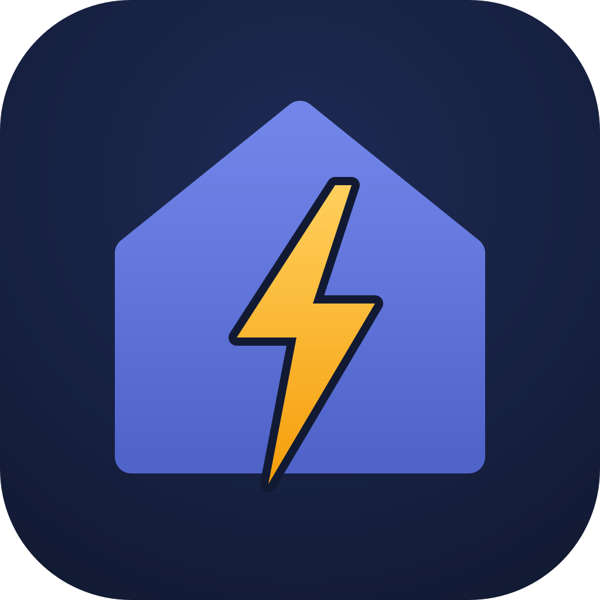
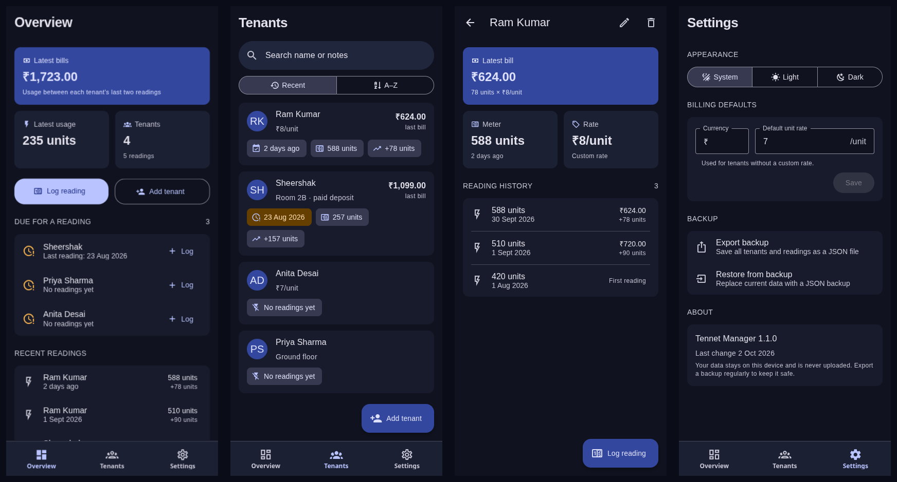

<p align="center">
  
</p>

# Tennet Manager

Track each tenant's electricity meter and see what they owe at a glance. Built with Expo Router, React Native and React Native Paper. Everything stays on the device.

## Features

- **Overview**: total of the latest bills and usage, tenants due for a reading (no reading in 30 days), and recent readings.
- **Tenants**: search by name or notes, sort by recent activity or A–Z, and see each tenant's last bill.
- **Readings**: date picker plus validation that keeps the meter increasing, even when you backdate a reading. The form previews usage and the estimated bill as you type.
- **Per-tenant rates**: leave a tenant's rate blank to use the default rate.
- **Backups**: export a JSON file through the share sheet (a download on web) and restore it later. The file is validated before your data is replaced.
- **System, light and dark themes**.

## Quick start

```bash
pnpm install
pnpm start        # then pick a platform, or scan with Expo Go
pnpm typecheck
```

## Project layout

- `app/`: Expo Router routes: tabs (`overview`, `tenants`, `settings`), tenant detail, and modal forms for tenants and readings.
- `src/DataContext.tsx`: app state with AsyncStorage persistence.
- `src/storage.ts`: loading, saving, backup import/export and data validation.
- `src/lib/`: date and money formatting, plus reading and billing calculations.
- `src/components/`: shared UI (`Screen`, `ReadingForm`, `TenantForm`, dialogs, cards).
- `src/theme.ts`: Material 3 light and dark palettes.
- `assets/icon.svg`: source for the app icon. The PNG icons are rendered from it.

## App preview


